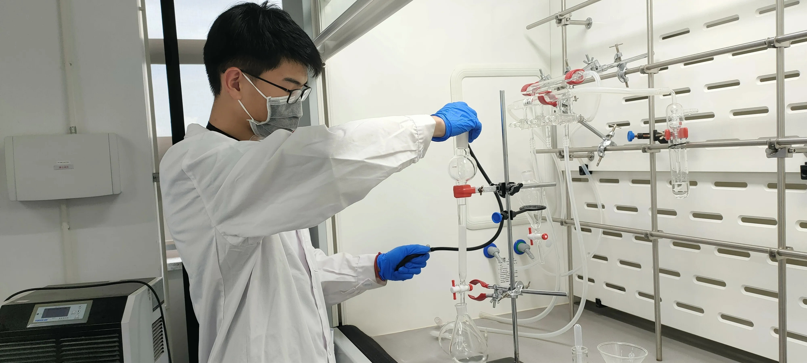

# Feiyu Huang | Academic Page

**Feiyu Huang** (黄飞宇) [[CV](./assets/CV.pdf)] [[Email](mailto:0711feiyu@gmail.com)] [[GitHub](https://github.com/huang-feiyu)] [[Blog (博客)](https://xn--29s704loyd.com/)]

- An undergraduate intern in [Immersive Design Group](https://www.seungwooje.com/home) supervised by [Prof. Je](https://www.seungwooje.com/) (2023.07 - 2023.12)
- An undergraduate majoring *computer science* in [Harbin Institute of Technology, Shenzhen](http://en.hitsz.edu.cn/) (2020.09 - 2024.06)

## Current Work

* Conduct one project in VR area (status: <s>motivation, related work, possible design</s> **Deprecated**)
* Conduct one project in the intersection of VR area and the disabled (status: research direction pending)
* Help to develop Unity 3D applications for user study

## Interests

1. How to help the blind walking in modern cities?
2. How to get a full experience in a virtual world without going other places?

Both the questions lead me to *Human-Computer Interaction* (HCI).

* Research Interests: AR/VR, Haptics (combining with bioinfo if possible)
* General Interests: Reading, Writing, Knowing problems and solving them

## Skills

* Linguistic: Chinese Native \| English Fluent (IELTS 7.0)
* Programming: C/C++, Java, Verilog, Go (with web development), Godot (with 2D game development)
* Developer Tools: Shell, Git/GitHub, Linux
* General Skills: Markdown, LaTeX, MS Office
* Soft Skills: Problem-Solving, Communication, Cooperation
